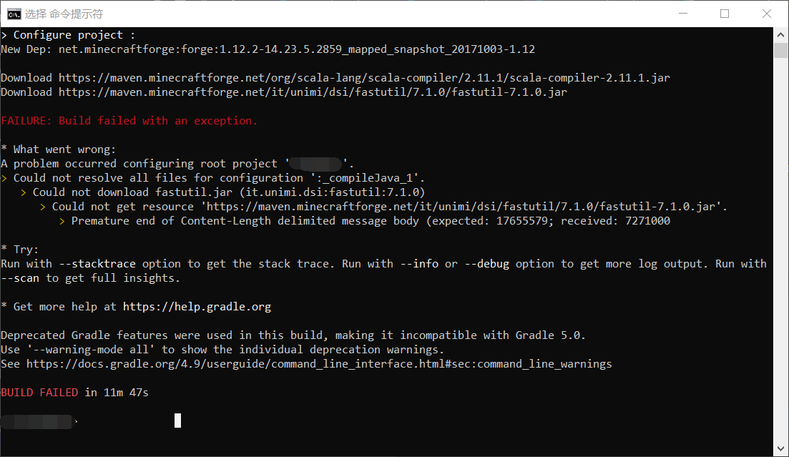

# 无法下载 fastutil.jar
配置开发环境时提示构建失败（`BUILD FAILED`），提示如下内容：
```
* What went wrong:
A problem occurred configuring root project '*******'.
> Could not resolve all files for configuration ':_compileJava_1'.
    > Could not download fastutil.jar (it.unimi.dsi:fastutil:7.1.0)
        > Could not get resource 'https://maven.minecraftforge.net/it/unimi/dsi/fastutil/7.1.0/fastutil-7.1.0.jar' .
            > Premature end of Content-Length delimited message body (expected: 17655579; received: 7271000
```

::: details 查看图片

:::

## 解决方案
使用国内Maven镜像来加速`fastutil.jar`文件的下载，本解决方案使用的是[阿里云Maven镜像](https://developer.aliyun.com/mvn/guide)。

在`build.gradle`文件中添加以下内容：
```groovy
buildscript {
    repositories {
        maven { url 'https://maven.aliyun.com/repository/public' } // 仅添加这一行
        // 其它代码请勿修改……
    }
    // 其它代码请勿修改……
}

repositories {
    maven { url 'https://maven.aliyun.com/repository/public' } // 仅添加这一行
}
// 其它代码请勿修改……
```

修改完毕后不一定能够立刻生效，在开发环境目录下打开**CMD命令提示符**，并运行如下命令清理Gradle进程：
```cmd
gradlew --stop
```
