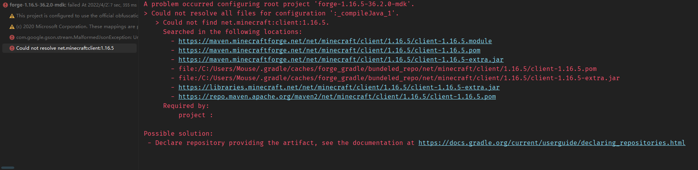

# 无法找到 net.minecraft:client
配置开发环境时提示构建失败（`BUILD FAILED`），提示如下内容：
```
A problem occurred configuring root project 'forge-1.16.5-36.2.0-mdk'.
> Could not resolve all files for configuration ':_compileJava_1'.
   > Could not find net.minecraft:client:1.16.5.
     Searched in the following locations:
       - https://maven.minecraftforge.net/net/minecraft/client/1.16.5/client-1.16.5.module
       - https://maven.minecraftforge.net/net/minecraft/client/1.16.5/client-1.16.5.pom
       - https://maven.minecraftforge.net/net/minecraft/client/1.16.5/client-1.16.5-extra.jar
       - file:/C:/Users/Mouse/.gradle/caches/forge_gradle/bundeled_repo/net/minecraft/client/1.16.5/client-1.16.5.pom
       - file:/C:/Users/Mouse/.gradle/caches/forge_gradle/bundeled_repo/net/minecraft/client/1.16.5/client-1.16.5-extra.jar
       - https://libraries.minecraft.net/net/minecraft/client/1.16.5/client-1.16.5-extra.jar
       - https://repo.maven.apache.org/maven2/net/minecraft/client/1.16.5/client-1.16.5.pom
     Required by:
         project :
```

::: details 查看图片

:::

## 解决方案
这是由于Forge缓存的Minecraft版本清单（`manifest.json`）文件格式错误。删除所有`C:\Users\<当前用户>\.gradle\caches\forge_gradle\minecraft_repo\versions\`和`C:\Users\<当前用户>\.gradle\caches\forge_gradle\mcp_repo\versions\`文件夹内文件名包含`manifest.json`文件，连接网络重新配置环境即可解决。

