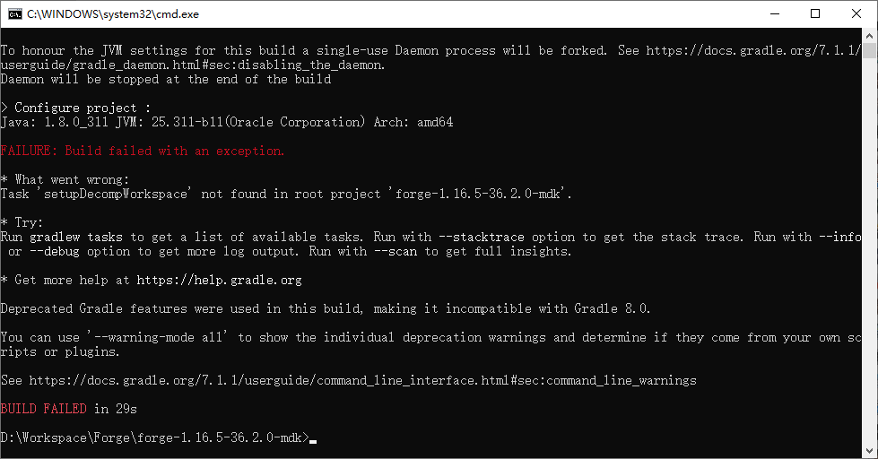

# 找不到任务 setupDecompWorkspace
运行`gradlew setupDecompWorkspace`命令时，提示`BUILD FAILED`构建失败。进一步查看`What went wrong`（出了什么问题）下的内容，提示`Task 'setupDecompWorkspace' not found in root project 'forge-x.xx.x-xx.x.x-mdk`。

::: details 查看图片

:::

## 解决方案
在**ForgeGradle 3**及以上版本（1.12.2-14.23.5.2847+或1.13+），不需要执行`setupDecompWorkspace`任务，直接将项目导入到IDE（集成开发环境）中，并等待项目同步完毕，即可完成开发环境配置，进行模组开发。