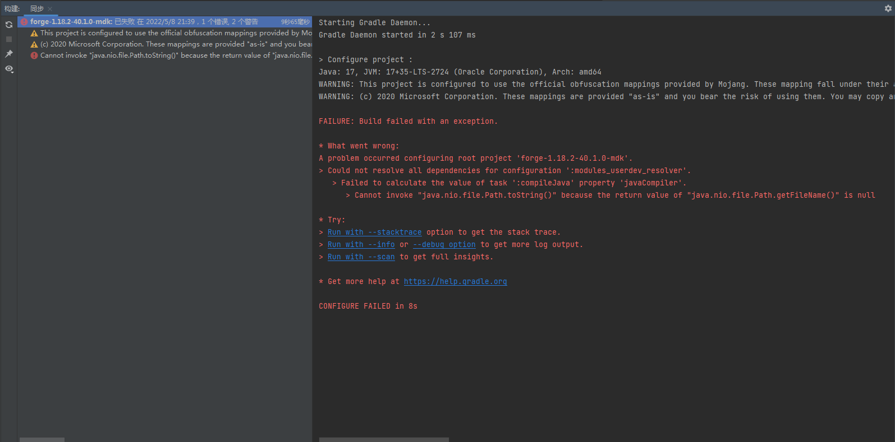

# Path.getFileName() 为空
导入开发环境或构建（`build`）时失败，提示如下内容：
```
Cannot invoke "java.nio.file.Path.toString()" because the return value of "java.nio.file.Path.getFileName()" is null
```

进一步查看Gradle日志，提示如下内容：
```log
* What went wrong:
A problem occurred configuring root project 'forge-1.18.2-40.1.0-mdk'.
> Could not resolve all dependencies for configuration ':modules_userdev_resolver'.
   > Failed to calculate the value of task ':compileJava' property 'javaCompiler'.
      > Cannot invoke "java.nio.file.Path.toString()" because the return value of "java.nio.file.Path.getFileName()" is null
```

::: details 查看图片

:::

## 解决方案
产生此问题的原因是JDK（Java Development Kit）被安装于根目录（`C:\`，`D:\`等），或有部分文件置于根目录下。删除安装于根目录的JDK，再将其安装于某一文件夹下，不得安装于形如`C:\`，`D:\`的根目录，或将位于根目录下的文件移动到某一文件夹下。