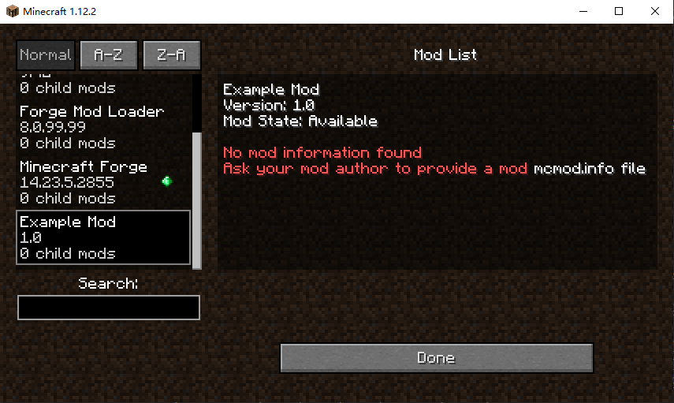

# 运行 runClient 时无法加载资源
于ForgeGradle 3.+版本运行`runClient`时无法加载资源，表现为模组信息（`mcmod.info`文件）无法加载，或纹理贴图文件无法加载。但是运行`build`并将生成的模组安装到游戏中时，又能够正常地加载模组信息和纹理贴图文件。

::: details 查看图片

:::

## 解决方案
在`build.gradle`文件内容末尾添加以下代码：
```groovy
sourceSets { 
    main { 
        output.resourcesDir = output.classesDir 
    } 
}
```

::: details 其他解决方案①
在`build.gradle`文件内容末尾添加以下代码：
```groovy
sourceSets { 
    main { 
        output.resourcesDir = java.outputDir
    } 
}
```
:::

::: details 其他解决方案②
在`build.gradle`文件内容末尾添加以下代码：
```groovy
sourceSets {
	main {
		output.resourcesDir = file('build/combined')
		java.outputDir = file('build/combined')
	}
}
```
:::

## 参考资料
- [关于IDEA构建模组时资源文件（如mcmod.info等）无法正确打包的解决办法](https://www.mcbbs.net/thread-1173660-1-2.html)
- [Modding with IntelliJ | The asset problem](https://forums.minecraftforge.net/topic/77064-solved-modding-with-intellij-the-asset-problem/)
- [Add extra resource folder to runClient](https://forums.minecraftforge.net/topic/61626-add-extra-resource-folder-to-runclient/)
- [IntelliJ IDEA: runClient task: textures not shown](https://www.reddit.com/r/feedthebeast/comments/e4hfzz/intellij_idea_runclient_task_textures_not_shown/)
- [DeflatedPickle/minecraft-forge-1.12-template](https://github.com/DeflatedPickle/minecraft-forge-1.12-template/blob/main/build.gradle)